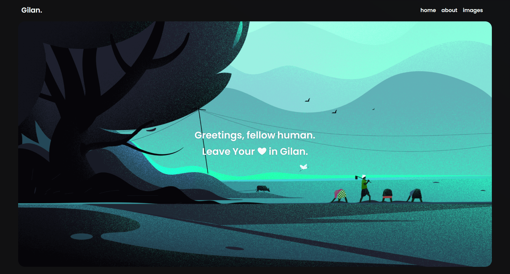

# vanillajs-spa

## To run this project

1. Clone the project
  ```bash
  https://github.com/alirezashafii/vanillajs-spa.git
  ```
2. Install dependencies
  ```bash
  npm install
  #or
  yarn add
  ```
 
3. Run the server.js file in the project root path:
  ```bash
  node server.js
  ```

Open [http://localhost:5500](http://localhost:5500) with your browser to see the result.

